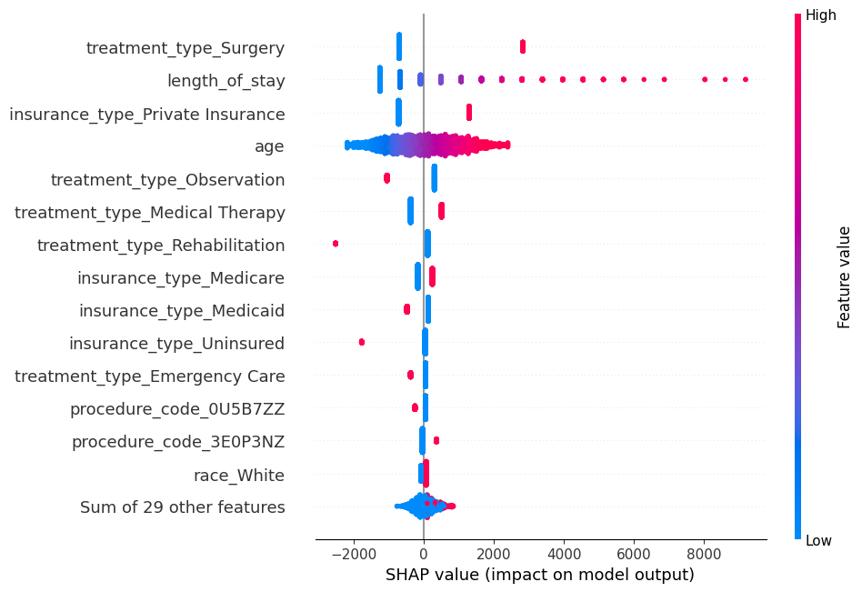

# Hospital Treatment Pricing Predictor

An interactive machine learning project that predicts hospital treatment charges using patient demographics, diagnosis codes, procedures, and insurance information. Built with `scikit-learn`, `SHAP`, `fairlearn`, and deployed via Streamlit.

---

## 📌 Project Objective

To forecast total hospital charges for patients based on admission data. This model supports healthcare cost transparency, highlights pricing disparities, and enables policy and patient-level decision-making.

---

## 📂 Dataset

**Source**: Synthetic data generated using `SDV` and `Faker`.  
**Size**: 10,000 records × 9 features  
**Features**:
- `age`, `gender`, `race`
- `diagnosis_code`, `procedure_code`
- `treatment_type`, `insurance_type`
- `length_of_stay`
- `total_charges` (target)

> *Note: This dataset is synthetic and does not contain real patient information.*

---

## 🧠 Techniques Used

| Category            | Tools/Methods                               |
|---------------------|---------------------------------------------|
| Modeling            | Linear Regression, Random Forest, XGBoost   |
| Fairness Analysis   | Group-wise MAE, Demographic Parity, Equalized Odds |
| Interpretability    | SHAP (beeswarm plots)                       |
| Evaluation          | MAE, RMSE, R² Score                         |
| Deployment          | Streamlit                                   |

---

## 📊 Key Results

| Model              | MAE (USD) | RMSE (USD) | R² Score |
|-------------------|-----------|------------|----------|
| Linear Regression | 2,842.16  | 3,661.56   | 0.3954   |
| Random Forest     | 2,907.92  | 3,769.47   | 0.3593   |
| XGBoost           | 2,807.93  | 3,655.15   | 0.3976   |

✅ **XGBoost** was the most accurate model, achieving ~\$2,800 MAE.

---

## ⚖️ Fairness Analysis

| Metric                         | Gender Result |
|-------------------------------|----------------|
| Demographic Parity Difference | 0.0249         |
| Equalized Odds Difference     | 0.0252         |

🔍 Fairness metrics indicate low bias across gender and race, though further mitigation can be applied.

---

## 🔍 SHAP Interpretability

SHAP analysis revealed that:
- `treatment_type_Surgery` and `length_of_stay` are the top cost drivers.
- `insurance_type_Private Insurance` also contributes strongly to billing variation.



---

## 🖥️ Streamlit App

Interactively predict treatment charges:

### 🚀 [Try the App (Live)](http://localhost:8502/) 

Or run locally:
```bash
streamlit run app.py
```

## ⚖️ License

This project is licensed under the MIT License.

You are free to use, modify, and distribute this project with attribution.


## 🙋‍♀️ Author

**Sneha Dutt**  
B.Sc. Computer Science, Minor in Accounting  
Healthcare Analytics | Fair AI | Streamlit App Developer  

📫 [LinkedIn](https://www.linkedin.com/in/sneha-dutt/)  
💻 [Portfolio](https://snehaaa8.github.io/)  
🐙 [GitHub](https://github.com/snehaaa8)
